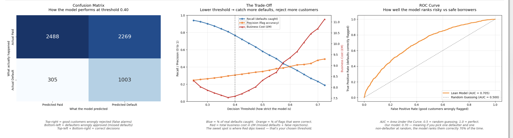

# Credit Risk Classification — Lending Club Loan Default Prediction

A logistic regression model that predicts which loan applications are most likely to default, built on Lending Club's 2007-2018 accepted loans dataset. Includes a full leakage audit, threshold optimisation, and a director-friendly business cost analysis.

---

## The Business Problem

A consumer lender approves loans with a 22% default rate. Each default costs the business approximately £10,000, while wrongly rejecting a good customer costs approximately £2,000 in lost interest income. The goal: build a model that catches as many defaulters as possible without rejecting too many good customers.

---

## Final Model — Headline Numbers

| Metric | Value |
|--------|-------|
| Algorithm | Logistic Regression (class-weighted) |
| Features | 79 (no leakage, passed automated audit) |
| Decision Threshold | 0.40 (cost-optimal) |
| Recall (defaults caught) | 76.7% |
| Precision (flag accuracy) | 30.7% |
| ROC-AUC | 0.705 |
| Business Cost | £7.59M per 6,065 loans |
| Savings vs No Model | £5.5M per 6,065 loans |

---

## How I Built It — Iteration Loop

1. **Baseline** — Trained on 101 features with default threshold 0.5. Got ROC-AUC 0.75 / Recall 59%.
2. **Threshold tuning** — Lowered threshold to 0.35 to minimise business cost. Recall jumped to 82%.
3. **Coefficient audit** — Found `debt_settlement_flag_Y` with a coefficient of 1.50, far higher than any other feature. Investigated and confirmed it was post-default leakage.
4. **Leakage removal** — Dropped 7 leakage features + 15 weak features. Lean model: 79 features, ROC-AUC 0.70.
5. **Isolation experiment** — Tested a "leakage-only drop" model to confirm the score drop was entirely from leakage, not over-trimming.
6. **Re-tuned threshold** — On the clean model, the cost-optimal threshold became 0.40.
7. **Automated leakage audit** — Built a reusable Python script that checks every feature against three rules: coefficient magnitude, suspicious name patterns, and a whitelist of safe patterns. Verdict: 79 clean, 0 leakage. Production-ready.

---

## Three Views, Three Audiences

| Audience | Visual | What they get |
|----------|--------|---------------|
| Directors / Head of Risk | The Trade-Off chart (Recall + Precision + Business Cost) | One picture, business decision |
| Compliance / Modellers | Confusion Matrix | The four boxes — exactly what gets caught and missed |
| Regulators | ROC Curve + AUC | Ranking quality, model documentation |

---

## What I Learned

- **Standardisation is for human eyes, not for the model.** Same predictions, different coefficient interpretability.
- **You cannot engineer your way out of leakage.** Every feature must pass the Application-Time Test: *"Would this value exist at the moment of loan application?"*
- **A defensible 0.70 always beats a leaky 0.75.** Models that look brilliant in development often fail in production because of hidden leakage.
- **Threshold optimisation can be more valuable than algorithm improvement.** Same model, different cut-off, £528k saved.
- **Automated audits are starting points, not final verdicts.** Specific patterns beat vague ones. Whitelists override blacklists. The human analyst always confirms.

---

## Files

| File | Purpose |
|------|---------|
| `credit_risk_classification.ipynb` | Full notebook — data loading, cleaning, feature engineering, model training, audit, evaluation |
| `Project4_Credit_Risk_Brief.docx` | Business brief written before any modelling |
| `credit_risk_final_visualisation.png` | Three-chart final visual |
| `requirements.txt` | Python dependencies |

---

## Dataset

Lending Club accepted loans, 2007 to 2018Q4. Randomly sampled 50,000 rows from 2.2M for reproducibility (`random_state=42`). Source: Kaggle.

---

## Tools

Python · pandas · NumPy · scikit-learn · matplotlib · seaborn · Jupyter

---

## Author

**Kehinde Aduewa** — Final-year Business & Management student at the University of Essex, building machine learning projects for credit risk and financial services.

GitHub: [GabbyKay](https://github.com/GabbyKay)
